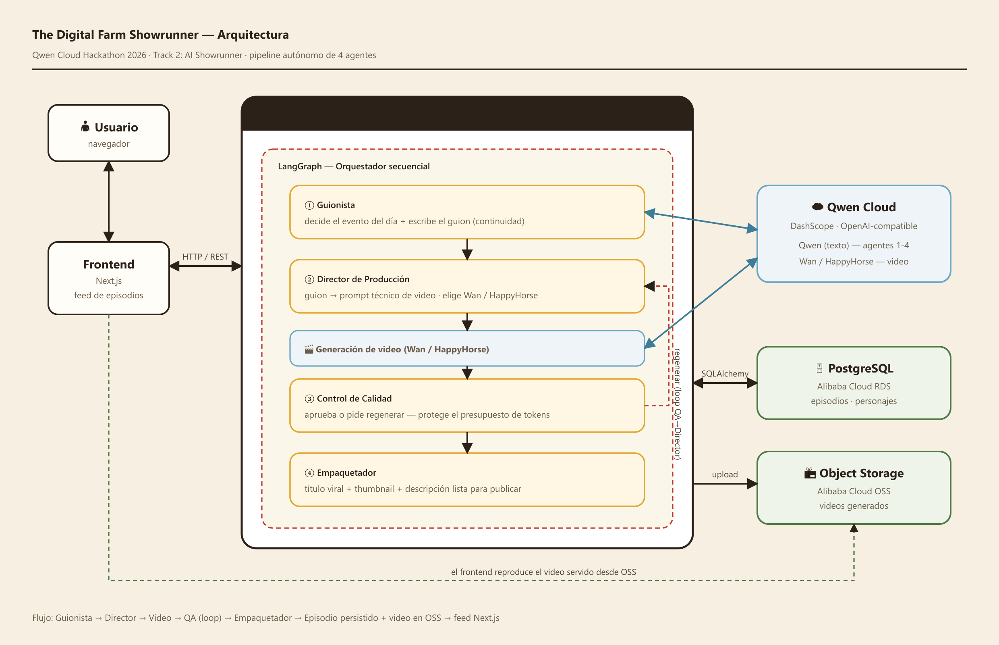

# Architecture — The Digital Farm Showrunner



> Editable source: [`architecture_diagram.svg`](architecture_diagram.svg).

## Agent flow

```
                 recent_events + base cast (SQLite / Alibaba RDS)
                                 │
                                 ▼
   ┌─────────────────── LangGraph orchestrator ───────────────────┐
   │                                                              │
   │  Agent 1  Scriptwriter ─► Agent 2  Production Director        │
   │  (Qwen text)             (Qwen text → keyframe + motion)     │
   │                                 │                            │
   │                                 ▼                            │
   │            Keyframe → Image-to-Video → Vision                │
   │            (Qwen-Image · HappyHorse i2v · Qwen3-VL)          │
   │                                 │                            │
   │                                 ▼                            │
   │                     Agent 3  Quality Control ──reject──┐     │
   │                          │ approve                     │     │
   │                          ▼            retake loop  ◄────┘     │
   │                     Agent 4  Packager                        │
   └──────────────────────────────┬───────────────────────────────┘
                                   ▼
             Episode row (DB) + video & keyframe on Alibaba Cloud OSS
                                   │
                                   ▼
                     Next.js feed  ◄── FastAPI /episodes
```

## Alibaba Cloud services
- **ECS (Docker)** — runs the FastAPI backend (one-command deploy in [`deploy/deploy.sh`](../backend/deploy/deploy.sh)).
- **RDS (PostgreSQL)** — optional production persistence for episodes and characters (SQLite by default).
- **OSS** — storage for generated videos and keyframes (see [`backend/services/oss_client.py`](../backend/services/oss_client.py) and [`backend/deploy/alibaba_deploy_proof.py`](../backend/deploy/alibaba_deploy_proof.py)).

## Qwen Cloud (DashScope)
- Text models (agents 1-4): `qwen3.7-plus` via the OpenAI-compatible endpoint.
- Image (keyframes + character portraits): `qwen-image-2.0` via the native multimodal endpoint.
- Video (image-to-video): `happyhorse-1.1-i2v` via the native async submit/poll endpoint. An episode can be N chained shots (setup→escalation→punchline) — one keyframe→i2v per shot, stitched into a single continuous video via ffmpeg (`SHOTS_PER_EPISODE`; a real 3-shot Pepe episode stitched to 15.5s on OSS).
- Video understanding (QA vision): `qwen3-vl-plus`. Also powers an optional identity-lock check (`IDENTITY_CHECK`) that scores each keyframe's character against its canonical portrait (`0.0–1.0`) — enforced by *scoring* the result, since the image endpoint accepts no reference image (calibrated 0.9 for a match, 0.0 for a mismatch).
