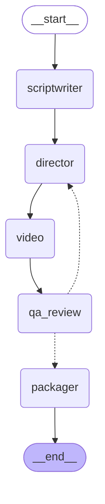

# LangGraph pipeline

The real graph generated by LangGraph (`pipeline/orchestrator.py`). The dashed edges
from `qa_review` are the conditional edge: approve → `packager`; reject with budget
remaining → `director` (the self-correcting retake loop, up to `MAX_REGEN` times).

The `video` node is a sub-stage, not a single call: keyframe (`qwen-image-2.0`) →
image-to-video (`happyhorse-1.1-i2v`) → vision (`qwen3-vl-plus`). When
`SHOTS_PER_EPISODE > 1` the Director emits a `shots` list and the node renders one
keyframe→clip per beat (setup→escalation→punchline), stitched into a single video via
ffmpeg (`video_gen_client.stitch()`). When `IDENTITY_CHECK` is on, the node also scores
the keyframe's character against its canonical portrait (`0.0–1.0`, stored per take as
`consistency`).
