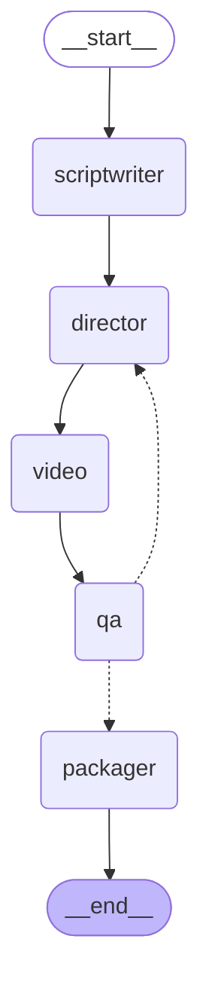

# Pipeline LangGraph

Grafo real generado por LangGraph (`pipeline/orchestrator.py`). Las aristas
punteadas desde `qa` son la arista condicional: aprueba → `packager`; rechaza y
queda presupuesto → `director` (loop de regeneración, hasta `MAX_REGEN` veces).

